Proiect DEEA
============

Ursesc Sebastian - 325 CA , ACS 2025-2026

**Disclaimer:** Circuitul trimis pe teams folosea alti tranzistori. Au fost inlocuiti din cauza ca nu am gasit, dar performanta este practic identica.

# Documentatie

The schematic:
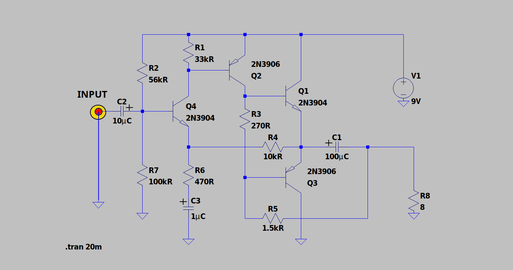

The Phyisical Circuit:
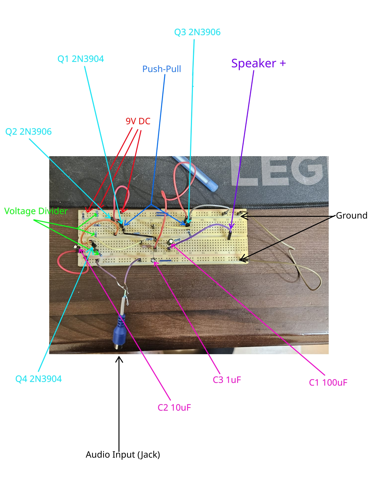

## Functionalitate

Demonstratie circuit video (prezent si ca fisier): https://www.youtube.com/watch?v=KiDGn5LEvNs&t=64s

It can also run Doom (kinda): https://www.youtube.com/watch?v=LcTMaiQpkIQ

Circuitul reprezinta un amplificator audio in configuratie push-pull.
Functionarea se bazeaza pe amplificarea succesiva a semnalului audio de intrare pana la un nivel suficient de mare pentru a alimenta un difuzor de 8 ohm, 10 W (R8).

Fluxul semnalului:
  - Semnalul audio intra prin condensatorul de cuplaj C2 (10µC) care blocheaza componenta DC
  - Etajul de intrare (Q4) realizeaza o prima amplificare și inversare de faza
  - Etajele driver (Q2, Q3) amplifica semnalul pentru a comanda tranzistorii de putere finali
  - Etajul de ieșire (Q1) livreaza puterea către difuzor prin condensatorul C1 (100µC)

Circuitul amplifica semnale mici (< ~1 Vpp). La semnale mai mari, apar distorsiuni de clipare (caracteristic amplificatoarelor push-pull).

## Rolul componentelor din circuit

Circuitul este alimentat de o sursa de 9V DC.

Etajul de intrare (Q4 - 2N3904 NPN):
  - R2 (56kohm) și R7 (100kohm) formeaza divisorul de tensiune pentru polarizarea bazei
  - R6 (470ohm) și C3 (1uF) formeaza circuitul de emisor cu decuplaj, stabilizand punctul de funcționare
  - C2 (10uF) asigura cuplajul AC, blocând componenta DC a semnalului de intrare

Etajul driver (Q2 - 2N3906 PNP):
  - R1 (33kohm) limiteaza curentul de baza
  - R3 (270ohm) și R4 (10kohm) stabilizeaza polarizarea și asigura cuplajul cu etajul final
  - Transistorul PNP permite configuratia push-pull complementara

Etajul de ieșire:
  - Q1 (2N3904 NPN) și Q3 (2N3906 PNP) formeaza perechea complementara push-pull
  - Q1 conduce în semiperioada pozitiva, Q3 în cea negativa
  - R5 (1.5kohm) asigură polarizarea pentru Q3
  - C1 (100uF) blocheaza componenta DC către difuzor
  - R8 (8ohm) reprezinta sarcina (difuzorul)

## Efectele devalorizarii pieselor

Condensatoare electronice (C1, C2, C3):
  - Degradare: Uscarea electrolitului în timp -> creșterea ESR (rezistentei serie echivalente) si scăderea capacitătii
  - Efecte: Distorsiuni la frecvente joase, ruperea cuplajului AC -> zgomote, instabilitate termica
  - Simptome: Sunet slab, distorsionat sau absent, incalzire excesiva

Tranzistori (Q1-Q4):
  - Degradare: Creșterea curentului de scurgere, deteriorarea jonctiunilor prin cicluri termice
  - Efecte: Amplificare insuficienta, distorsiuni de crossover (la trecerea dintre semiperioade), punct de functionare deplasat
  - Simptome: Volum redus, distorsiuni la putere mare, "noise"

Rezistori:
  - Degradare: Modificarea valorii rezistentei (±10-20%) din cauza imbatranirii sau supraincalzirii
  - Efecte: Polarizare incorecta -> tranzistori în saturatie sau blocare, modificarea raspunsului in frecventa
  - Simptome: Functionare instabila, consum crescut, risc de ardere a componentelor

Consecințe generale:
  - Performante audio degradate (distorsiuni armonice, zgomot de fond)
  - Risc de avarie în cascada (un condensator defect poate suprasolicita tranzistorii)
  - Necesitatea inlocuirii componentelor pentru restabilirea functionarii optime

## Bill of materials

Rezistente:
 - 2 * 16 khom (R1)
 - 51 kohm + 5 kohm (R2)
 - 270 ohm (R3)
 - 10 khom (R4)
 - 1 kohm + 500 ohm (R5)
 - 470 ohm (R6)
 - 100 kohm (R7)
   
Condensatori:
 - 100 uF (C1)
 - 10 uF (C2)
 - 1 uF (C3)
   
Tranzistori:
 - 2 * 2N3904 NPN (Q1 + Q4)
 - 2 * 2N3906 PNP (Q2 + Q3)
   
Altele:
 - 13 fire
 - Jack audio input

# Simulare 

## Curent continuu:

Simularea in curent continuu este realizata prin a elimina generatorul de semnal.

### Boxa (R8)

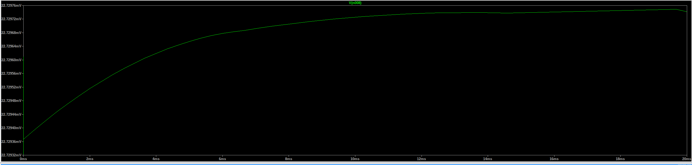

### Q1

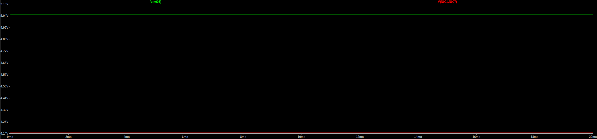

### Q2

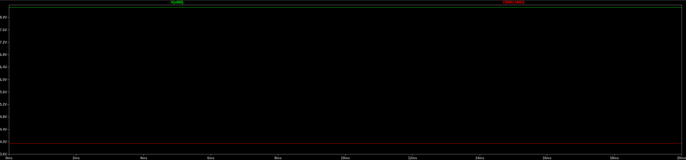

### Q3

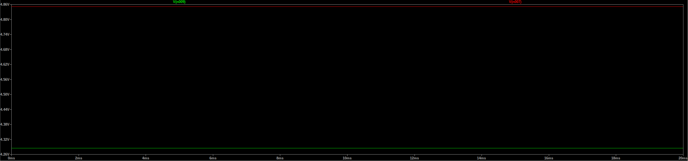

### Q4

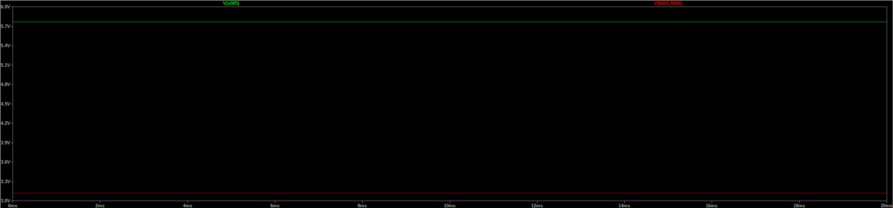

## Valori de semnal

### 0.05 Vpp 1000 Hz

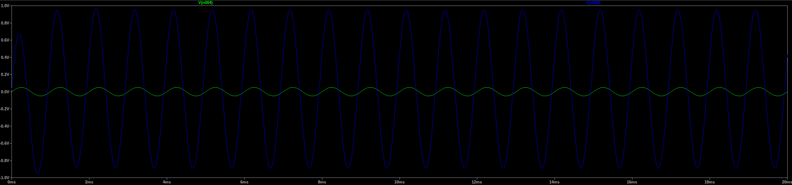

### 0.2 Vpp 13000 Hz

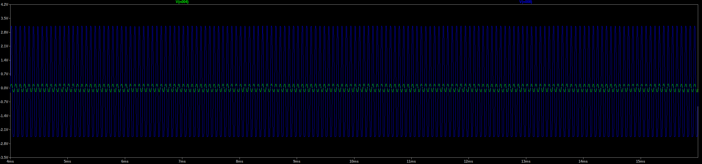

### 0.9 Vpp 8500 Hz

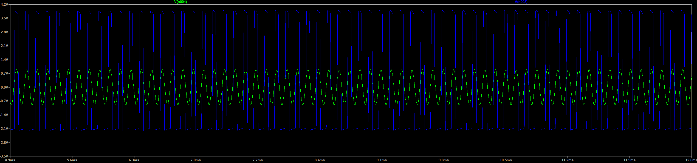

### 1.7 Vpp 5600 Hz

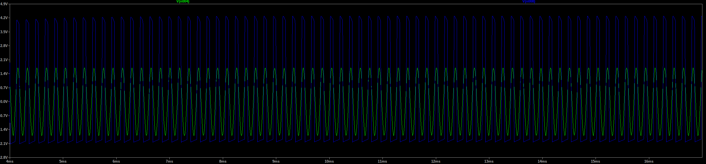

